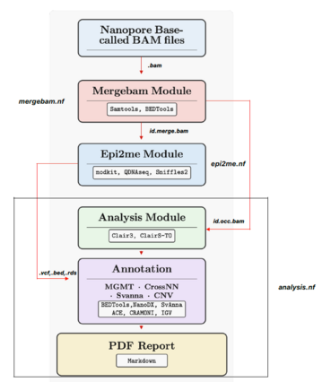

# nWGS_pipeline: Nanopore Whole Genome Sequencing Pipeline

[](https://www.nextflow.io/)
[](https://apptainer.org/)
[](https://www.docker.com/)
[](https://opensource.org/licenses/MIT)
[](https://github.com/VilhelmMagnusLab/nWGS_pipeline/releases)

## Overview

nWGS_pipeline is a comprehensive bioinformatics pipeline for analyzing Central Nervous System (CNS) samples using Oxford Nanopore sequencing data. It integrates multiple analyses including CNV detection, methylation profiling, structural variant calling, and MGMT promoter status determination.

## Pipeline Schematic

The nWGS pipeline follows a modular architecture with three main Nextflow modules (run_mode_mergebam, run_mode_epi2me and run_mode_analysis) that can be run independently or sequentially:

<div align="center">



</div>

*Pipeline workflow showing the flow from Nanopore BAM files through Mergebam, Epi2me, and Analysis modules to final PDF reports.*

## Quick Start

### Prerequisites
- **Docker** (Desktop/Local) or **Singularity/Apptainer** (HPC)
- **Nextflow** (auto-installed by setup scripts)

### One-Command Setup & Run

**For Docker (Desktop/Local):**
```bash
git clone https://github.com/VilhelmMagnusLab/nWGS_pipeline.git
cd nWGS_pipeline
chmod +x setup_docker.sh
./setup_docker.sh
./run_pipeline_docker.sh --run_mode_order --sample_id YOUR_SAMPLE_ID
```

**For Singularity/Apptainer (HPC):**
```bash
git clone https://github.com/VilhelmMagnusLab/nWGS_pipeline.git
cd nWGS_pipeline
chmod +x setup_singularity.sh
./setup_singularity.sh
./run_pipeline_singularity.sh --run_mode_order --sample_id YOUR_SAMPLE_ID
```

## Pipeline Modules

The pipeline consists of three main modules that can be run independently or sequentially:

### 1. **Mergebam Pipeline** (`--run_mode_mergebam`)
- Merges multiple BAM files per sample
- Extracts protein-coding regions of interest using `OCC.protein_coding.bed`

### 2. **Epi2me Pipeline** (`--run_mode_epi2me`)
Three independent analysis types:

| Analysis | Tool | Purpose | Output |
|----------|------|---------|---------|
| **Modified Base Calling** | Modkit | DNA modifications (5mC, 5hmC) | `*_wf_mods.bedmethyl.gz` |
| **Structural Variants** | Sniffles2 | Structural variant detection | `*.sniffles.vcf.gz` |
| **Copy Number Variation** | QDNAseq | CNV detection | `*_segs.bed`, `*_bins.bed`, `*_segs.vcf` |

### 3. **Analysis Pipeline** (`--run_mode_analysis`)
- **MGMT methylation analysis** using EPIC array sites
- **NanoDx neural network classification**
- **Structural variant annotation** with Svanna
- **CNV analysis** with ACE tumor content determination
- **Comprehensive reporting** (HTML, IGV snapshots, Circos plots, Markdown)

## Pipeline Run Modes

The pipeline can be executed in different modes:

| Mode | Flag | Description | Use Case |
|------|------|-------------|----------|
| **Complete Pipeline** | `--run_mode_order` | Runs all three modules sequentially (Mergebam → Epi2me → Analysis) | Starting from raw BAM files |
| **Epi2me + Analysis** | `--run_mode_epianalyse` | Runs Epi2me and Analysis sequentially (assumes merged BAM files exist) | When BAM files are already merged |
| **Mergebam Only** | `--run_mode_mergebam` | Merges BAM files and extracts regions of interest | BAM preparation only |
| **Epi2me Only** | `--run_mode_epi2me [all\|modkit\|cnv\|sv]` | Runs specific Epi2me analyses | Methylation, CNV, or SV calling |
| **Analysis Only** | `--run_mode_analysis [all\|mgmt\|cnv\|svannasv\|terp\|occ\|rmd]` | Runs specific downstream analyses | Report generation or specific analyses |

## Container Systems

| Feature | Docker | Singularity/Apptainer |
|---------|--------|----------------------|
| **Best for** | Desktop/Local | HPC/Shared systems |
| **Setup Script** | `setup_docker.sh` | `setup_singularity.sh` |
| **Run Script** | `run_pipeline_docker.sh` | `run_pipeline_singularity.sh` |

All containers are automatically downloaded from [vilhelmmagnuslab Docker Hub](https://hub.docker.com/repositories/vilhelmmagnuslab).

## Usage Examples

### Complete Pipeline (Recommended)
```bash
# Docker - Full pipeline starting from raw BAM files
./run_pipeline_docker.sh --run_mode_order --sample_id T001

# Singularity/Apptainer - Full pipeline starting from raw BAM files
./run_pipeline_singularity.sh --run_mode_order --sample_id T001
```

### Epi2me + Analysis (When BAM files are already merged)
```bash
# Docker - Skip mergebam, run Epi2me and Analysis
./run_pipeline_docker.sh --run_mode_epianalyse --sample_id T001

# Singularity/Apptainer - Skip mergebam, run Epi2me and Analysis
./run_pipeline_singularity.sh --run_mode_epianalyse --sample_id T001
```

### Individual Modules

**Docker Commands:**
```bash
# Mergebam only
./run_pipeline_docker.sh --run_mode_mergebam

# Epi2me analyses
./run_pipeline_docker.sh --run_mode_epi2me all          # All Epi2me analyses
./run_pipeline_docker.sh --run_mode_epi2me modkit       # Modified base calling only
./run_pipeline_docker.sh --run_mode_epi2me cnv          # CNV analysis only
./run_pipeline_docker.sh --run_mode_epi2me sv           # Structural variants only

# Analysis modules
./run_pipeline_docker.sh --run_mode_analysis all        # All analyses
./run_pipeline_docker.sh --run_mode_analysis mgmt       # MGMT analysis only
./run_pipeline_docker.sh --run_mode_analysis cnv        # CNV analysis only
./run_pipeline_docker.sh --run_mode_analysis svannasv   # Svanna SV annotation only
./run_pipeline_docker.sh --run_mode_analysis terp       # TERTp promoter analysis only
./run_pipeline_docker.sh --run_mode_analysis occ        # Clair3 and ClairS-TO annotation using OCC region of interest BAM file
./run_pipeline_docker.sh --run_mode_analysis rmd        # Markdown report only
```

**Singularity/Apptainer Commands:**
```bash
# Mergebam only
./run_pipeline_singularity.sh --run_mode_mergebam

# Epi2me analyses
./run_pipeline_singularity.sh --run_mode_epi2me all          # All Epi2me analyses
./run_pipeline_singularity.sh --run_mode_epi2me modkit       # Modified base calling only
./run_pipeline_singularity.sh --run_mode_epi2me cnv          # CNV analysis only
./run_pipeline_singularity.sh --run_mode_epi2me sv           # Structural variants only

# Analysis modules
./run_pipeline_singularity.sh --run_mode_analysis all        # All analyses
./run_pipeline_singularity.sh --run_mode_analysis mgmt       # MGMT analysis only
./run_pipeline_singularity.sh --run_mode_analysis cnv        # CNV analysis only
./run_pipeline_singularity.sh --run_mode_analysis svannasv   # Svanna SV annotation only
./run_pipeline_singularity.sh --run_mode_analysis terp       # TERT promoter analysis only
./run_pipeline_singularity.sh --run_mode_analysis occ        # Clair3 and ClairS-TO annotation using OCC region of interest BAM file
./run_pipeline_singularity.sh --run_mode_analysis rmd        # Markdown report only
```

## Input Requirements

### Sample ID File Format
```
# For analysis pipeline (with tumor content)
sample_id1   0.75    # 75% tumor content
sample_id2          # Auto-calculate with ACE

# For mergebam pipeline (with flowcell)
sample_id1   flowcell_id1
sample_id2   flowcell_id2
```

### Directory Structure

The pipeline uses a standardized directory structure with separate input and output paths:

```
Pipeline directory:
/data/routine_nWGS_pipeline/nWGS_pipeline/
├── conf/                         # Configuration files
│   ├── mergebam.config          # Mergebam module config
│   ├── epi2me.config            # Epi2me module config
│   └── analysis.config          # Analysis module config
├── modules/                      # Nextflow modules
├── containers/                   # Singularity container images
├── bin/                         # Helper scripts
├── docs/                        # Documentation
└── smart_sample_monitor_v2.sh  # Automated monitoring script

Pipeline data directory (configured via params.path):
/data/routine_nWGS_pipeline/nWGS_pipeline/data/
├── reference/                    # Reference files (GRCh38, BED files, etc.)
└── humandb/                      # Annotation databases

Input data directory (configured via params.input_dir in mergebam.config):
/data/WGS_[DATE]/                # Oxford Nanopore sequencing output
├── SAMPLE_01/                    # Sample directory
│   └── [subdirectory]/          # Any subdirectory structure
│       ├── *.bam                # BAM files from ONT sequencing
│       ├── *.bam.bai            # BAM index files
│       └── final_summary_*_*_*.txt  # Completion marker file
├── SAMPLE_02/
│   └── [subdirectory]/
│       ├── *.bam
│       ├── *.bam.bai
│       └── final_summary_*_*_*.txt
└── ...

Output directory (configured via params.path_output):
/data/routine_nWGS/
├── sample_ids_bam.txt           # Sample IDs for BAM merging
│
├── routine_bams/                # Processed BAM files (Mergebam module)
│   ├── merge_bams/              # Merged BAM files per sample
│   └── roi_bams/                # Region of interest extracted BAMs
│
├── routine_epi2me/              # Epi2me module results
│   └── [sample_id]/
│       ├── *.wf_mods.bedmethyl.gz     # Methylation calls (modkit)
│       ├── *.sniffles.vcf.gz          # Structural variants (Sniffles2)
│       ├── *_segs.bed                 # CNV segments (QDNAseq)
│       ├── *_bins.bed                 # CNV bins
│       ├── *_copyNumbersCalled.rds    # CNV RDS file for ACE
│       ├── clair3/                    # Germline SNV calling (Clair3)
│       │   └── *.vcf.gz
│       └── clairs-to/                 # Somatic SNV calling (ClairS-TO)
│           └── *.vcf.gz
│
├── routine_analysis/            # Analysis module results (detailed outputs)
│   └── [sample_id]/
│       ├── classifier/          # Tumor classification
│       │   ├── nanodx/         # NanoDx neural network results
│       │   └── sturgeon/       # Sturgeon methylation classifier
│       ├── cnv/                 # CNV analysis
│       │   ├── ace/            # ACE tumor content estimation
│       │   ├── annotatedcnv/   # Annotated CNV calls
│       │   └── *.pdf           # CNV plots (chr7, chr9, full genome)
│       ├── coverage/            # IGV coverage snapshots
│       │   ├── *_egfr_coverage.pdf
│       │   ├── *_idh1_coverage.pdf
│       │   ├── *_idh2_coverage.pdf
│       │   └── *_tertp_coverage.pdf
│       ├── cramino/             # BAM statistics
│       │   └── *_cramino_statistics.txt
│       ├── merge_annot_clair3andclairsto/  # Variant annotation
│       │   └── *_merge_annotation_filter_snvs_allcall.csv
│       ├── methylation/         # MGMT methylation analysis
│       │   └── *_MGMT_results.csv
│       └── structure_variant/   # SV annotation
│           ├── *_circos.pdf    # Circos plot
│           ├── *_fusion_events.tsv  # Fusion events
│           └── *_svanna_annotation.html  # Svanna SV annotation
│
└── routine_results/             # Final published reports (per sample)
    └── [sample_id]/
        ├── [sample_id]_bedmethyl_sturgeon_general.pdf  # Sturgeon classification
        ├── [sample_id]_markdown_pipeline_report.pdf    # Main comprehensive report
        ├── [sample_id]_mnpflex_input.bed               # MNP-Flex input format
        ├── [sample_id]_occ_svanna_annotation.html      # SV annotation HTML
        └── [sample_id]_tsne_plot.html                  # t-SNE visualization
```

## Required Reference Data

### Reference Files Required
The following reference files must be downloaded and placed in the `data/reference/` directory:

**Analysis-specific files:**
- `OCC.fusions.bed` - Fusion genes
- `EPIC_sites_NEW.bed` - Methylation sites
- `MGMT_CpG_Island.hg38.bed` - MGMT CpG islands
- `OCC.protein_coding.bed` - Protein-coding gene regions for SNV screening and BAM extraction (must be proper 10-field BED format)
- `TERTp_variants.bed` - TERT promoter variants
- `human_GRCh38_trf.bed` - Tandem repeat regions
- `Others` file downloaded from Zenodo should be put into `data/reference/`

**Note:** The `OCC.protein_coding.bed` file is used throughout the pipeline for:
  - Extracting protein-coding regions during BAM merging (mergebam module)
  - SNV screening regions for variant calling (ClairS-TO analysis)
  - Ensure this file is properly formatted with exactly 10 tab-separated fields per line

**Annotation databases (place in `data/humandb/`):**
- `hg38_refGene.txt` - RefGene annotation
- `hg38_refGeneMrna.fa` - RefGene mRNA sequences
- `hg38_clinvar_20240611.txt` - ClinVar annotations
- `hg38_cosmic100coding2024.txt` - Cosmic annotations

**svanna databases (place in `data/reference/`):**
- `svanna-data.zip` - svanna database need to be unzip after download and place into the reference folder or the database can be downloaded from (https://github.com/monarch-initiative/SvAnna)

**nanoDX script and files (place in `data/reference/`):**

The nanoDX folder in the pipeline root should be moved into the `data/reference` folder and copy the following downloded files from https://zenodo.org/records/14006255 into `nanoDx/static/`:
- `Capper_et_al.h5` (model file)
- `Capper_et_al.h5.md5` (checksum)
- `Capper_et_al_NN.pkl` (neural network)

**ONT basecalling model (place directory in `data/reference/`):**
- `r1041_e82_400bps_sup_v420/`  # Required by ClairS-TO; used via `clairsto_models`. The model ZIP file `r1041_e82_400bps_sup_v420.zip` can be downloaded from Zenodo and then unzipped.

**Assembly folder (included in Zenodo download, place in `data/reference/`):**
- `Assembly/` - Assembly reference folder required for vcfcircos visualization (included in Zenodo download. The file need to be unzip after download)
  - **Important:** Ensure the correct path to the reference directory is configured in your `option.json` file
  - The "Static" parameter in `option.json` should point to your `data/reference` directory path

**Download files from [Zenodo](https://doi.org/10.5281/zenodo.15916972) and place them in the appropriate directories.**

### Directory Structure Setup
After downloading the reference files, your directory structure should look like this:

```
data/
├── reference/                    # Reference files
│   ├── GRCh38.fa
│   ├── GRCh38.fa.fai
│   ├── gencode.v48.annotation.gff3
│   ├── Assembly/                # Assembly folder for vcfcircos (from Zenodo)
│   ├── OCC.fusions.bed
│   ├── EPIC_sites_NEW.bed
│   ├── MGMT_CpG_Island.hg38.bed
│   ├── OCC.protein_coding.bed
│   ├── TERTp_variants.bed
│   └── human_GRCh38_trf.bed
│   └── etc

├── humandb/                     # Annotation databases
│   ├── hg38_refGene.txt
│   ├── hg38_refGeneMrna.fa
│   ├── hg38_clinvar_20240611.txt
│   └── hg38_cosmic100coding2024.txt
├── testdata/                    # Your input data
│   ├── sample_ids.txt
│   └── single_bam_folder/       # BAM files
└── results/                     # Output (auto-created)
```

### External Downloads Required
**Place this file in `data/reference/`:**
- **Gencode annotation**: [Gencode v48](https://ftp.ebi.ac.uk/pub/databases/gencode/Gencode_human/release_48/gencode.v48.annotation.gff3.gz)
  - Download and place as: `gencode.v48.annotation.gff3`

## ACE Tumor Content Calculation

The pipeline intelligently handles tumor content:
- **Provided value**: Use directly if specified in sample ID file
- **Auto-calculation**: ACE analyzes copy number profiles to estimate tumor cellularity
- **Multiple estimates**: ACE provides several estimates and selects the best fit
- **Results**: Saved in `${sample_id}_ace_results/threshold_value.txt`

## Output Structure

```
results/
├── mergebam/
│   ├── merge_bam/               # Merged BAM files
│   └── occ_bam/                 # Regions of interest BAMs
├── epi2me/
│   ├── episv/                   # Structural variants
│   ├── modkit/                  # Modified base calling
│   └── epicnv/                  # Copy number variations
└── analysis/
    ├── cnv/                     # CNV analysis with ACE
    ├── sv/                      # Structural variant annotation
    ├── methylation/             # MGMT methylation analysis
    └── reports/                 # Comprehensive reports
```

## Report Generation

### Standard Report Generation

**PDF reports are automatically generated** when running the pipeline with the following modes:
- `--run_mode_analysis rmd` - Generate reports only
- `--run_mode_analysis all` - Run all analyses and generate reports
- `--run_mode_order` - Run complete pipeline sequentially and generate reports
- `--run_mode_epianalyse` - Run Epi2me and Analysis modules and generate reports

The reports are automatically created in the `results/report/` directory with the name `{sample_id}_markdown_pipeline_report.pdf`.

### Additional Report Generation

The `generate_report.sh` script is provided for **additional report generation** in cases where:
- You want to regenerate reports after re-running specific processes
- You need to create reports for samples that were processed separately
- You need to generate reports after the pipeline has already completed


## Configuration

### Path Configuration

The pipeline uses three main path parameters that must be configured:

**1. Pipeline Data Path (`params.path`)** - Reference files and databases
```groovy
// conf/analysis.config, conf/epi2me.config, conf/mergebam.config
params {
    path = "/data/routine_nWGS_pipeline/nWGS_pipeline/data"
    // Contains: reference/, humandb/ directories
}
```

**2. Input Data Path (`params.input_dir`)** - ONT sequencing output
```groovy
// conf/mergebam.config
params {
    input_dir = "/data/WGS_27102025"
    // Contains: Sample directories with BAM files
    // Can be overridden via CLI: --input_dir or smart_sample_monitor -d
}
```

**3. Output Path (`params.path_output`)** - Pipeline results
```groovy
// conf/mergebam.config, conf/epi2me.config, conf/analysis.config
params {
    path_output = "/data/routine_nWGS"
    // Contains: sample_ids_bam.txt, routine_bams/, routine_epi2me/, routine_results/
}
```

**Key Points:**
- `params.path`: Reference data (rarely changes)
- `params.input_dir`: ONT sequencing input (changes per run)
- `params.path_output`: Where all results are stored (consistent location)
- The `input_dir` can be overridden using `--input_dir` flag or `smart_sample_monitor_v2.sh -d`

### Container Configuration
Choose your preferred container engine:

**For Docker:**
- Uncomment Docker containers in configuration files
- Comment out Singularity/Apptainer containers
- Run: `./setup_docker.sh`

**For Singularity/Apptainer:**
- Use default Singularity/Apptainer containers
- Run: `./setup_singularity.sh`

## Quick Setup Guide

1. **Download reference files** from [Zenodo](https://doi.org/10.5281/zenodo.15916972)
2. **Place files** in appropriate directories (`data/reference/` and `data/humandb/`)
3. **Update paths** in configuration files (`conf/*.config`)
4. **Choose container engine** (Docker or Singularity/Apptainer)
5. **Run setup script**:
   ```bash
   # For Docker
   ./setup_docker.sh
   
   # For Singularity/Apptainer  
   ./setup_singularity.sh
   ```
6. **Test the pipeline**:
   ```bash
   # For Docker
   ./test_pipeline_docker.sh
   
   # For Singularity/Apptainer
   ./test_pipeline_singularity.sh
   ```

### Work Directory Customization
You can specify a custom temporary work directory using the `-w` flag. This is useful for:
- Managing disk space on different storage locations
- Avoiding permission issues
- Organizing temporary files

**Example:**
```bash
# Docker
./run_pipeline_docker.sh --run_mode_analysis tertp -w /path/to/your/work/dir

# Singularity/Apptainer  
./run_pipeline_singularity.sh --run_mode_analysis tertp -w /home/chbope/extension/trash/tmp
```

**Note:** The `-w` flag sets Nextflow's work directory where temporary files and intermediate results are stored during pipeline execution. By default nextflow create a folder `work` in the working directory.

### Log Output Customization
You can specify a custom log directory using the `--log-dir` flag.

**Example:**
```bash
# Docker
./run_pipeline_docker.sh --run_mode_analysis mgmt --log-dir /path/to/logs 

# Singularity/Apptainer
./run_pipeline_singularity.sh  --run_mode_analysis mgmt --log-dir /path/to/logs
```

**Note:** Logs include execution reports, timelines, traces, and Nextflow logs, automatically organized by sample ID.

## Automated Sample Monitoring

The pipeline includes `smart_sample_monitor_v2.sh` for **automated monitoring and processing** of Oxford Nanopore sequencing runs. This intelligent script continuously monitors sample directories and automatically triggers the pipeline when sequencing completes.

### Key Features:

**Monitoring & Execution:**
- **Real-time Monitoring**: Watches for `final_summary_*_*_*.txt` files indicating completed sequencing
- **Automatic Pipeline Triggering**: Starts processing immediately when samples are ready
- **Sequential Processing**: Processes one sample at a time, queuing others
- **Markdown Report Validation**: Verifies successful completion before marking as done

**Version 2 Enhancements:**
- **CLI Data Directory Override**: `--data-dir` takes precedence over `mergebam.config`
- **Resume Control**: Disabled by default for fresh runs; use `-r` to enable caching
- **Symlink Resolution**: Works correctly when installed as global command
- **Portable Execution**: Automatically finds pipeline directory from any location
- **Sample IDs File**: Hardcoded to `/data/routine_nWGS/sample_ids_bam.txt`

### Basic Usage:

```bash
# Run from pipeline directory with default config
./smart_sample_monitor_v2.sh

# Monitor specific data directory (overrides config)
./smart_sample_monitor_v2.sh -d /data/WGS_27102025

# Enable resume for cached results
./smart_sample_monitor_v2.sh -d /data/WGS_27102025 -r

# Verbose logging
./smart_sample_monitor_v2.sh -d /data/WGS_27102025 -v

# Combination: resume + verbose
./smart_sample_monitor_v2.sh -d /data/WGS_27102025 -r -v
```

### Global Command Installation:

Install the monitor as a global command accessible from any directory:

**User-level installation (Recommended - No sudo required):**
```bash
# Create user bin directory and symbolic link
mkdir -p ~/bin
ln -sf /data/routine_nWGS_pipeline/nWGS_pipeline/smart_sample_monitor_v2.sh ~/bin/smart_sample_monitor

# Add ~/bin to PATH (run once)
cat >> ~/.bashrc << 'EOF'

# Add user's bin directory to PATH
if [ -d "$HOME/bin" ]; then
    export PATH="$HOME/bin:$PATH"
fi
EOF

# Activate changes
source ~/.bashrc

# Verify installation
which smart_sample_monitor
```

**System-wide installation (Requires sudo):**
```bash
sudo ln -sf /data/routine_nWGS_pipeline/nWGS_pipeline/smart_sample_monitor_v2.sh /usr/local/bin/smart_sample_monitor
```

**Then use from anywhere:**
```bash
# Run from any directory
cd /tmp
smart_sample_monitor -d /data/WGS_27102025 -v

# Monitor with custom work directory
smart_sample_monitor -d /data/WGS_27102025 -w /data/trash -r
```

### Command-Line Options:

| Option | Long Form | Description | Default |
|--------|-----------|-------------|---------|
| `-d` | `--data-dir` | Base data directory (overrides config) | Auto-detect from config |
| `-p` | `--pipeline` | Pipeline base directory | Auto-detected |
| `-w` | `--workdir` | Nextflow work directory | `/data/trash` |
| `-c` | `--config` | Config file to parse | `conf/mergebam.config` |
| `-i` | `--interval` | Check interval in seconds | 300 (5 min) |
| `-t` | `--timeout` | Maximum wait time in seconds | 432000 (5 days) |
| `-r` | `--resume` | Enable Nextflow resume | Disabled |
| `-v` | `--verbose` | Enable verbose logging | Disabled |
| `-h` | `--help` | Show help message | - |

### Workflow:

1. **Initialize**: Load sample IDs from `/data/routine_nWGS/sample_ids_bam.txt`
2. **Monitor**: Check each sample directory for `final_summary_*_*_*.txt`
3. **Queue**: Mark ready samples for processing
4. **Execute**: Run `--run_mode_order` for each sample sequentially
5. **Validate**: Check for markdown report generation
6. **Report**: Display final status summary

### Use Case:

This script is essential for **routine ONT sequencing workflows** where:
- Multiple samples complete sequencing at different times
- Immediate processing is desired upon completion
- Manual monitoring would be time-consuming and error-prone
- Consistent processing workflow is required

Instead of manually checking and starting the pipeline for each sample, the monitor **automatically detects completion** and starts processing immediately, **maximizing throughput** and **reducing manual intervention**.

**Important:** Ensure all paths are correctly configured in `conf/mergebam.config`:
- `params.path`: Reference data directory
- `params.input_dir`: Default input directory (can be overridden with `-d`)
- `params.path_output`: Output results directory

**See [docs/GLOBAL_COMMAND_SETUP.md](docs/GLOBAL_COMMAND_SETUP.md) for detailed installation, troubleshooting, and advanced usage.** 

## Troubleshooting

### Common Issues
1. **Container engine conflict**: Ensure only one container system is enabled
2. **Missing reference files**: Download required external files
3. **Permission issues**: Check container and file permissions

### Verification Commands
```bash
# Check containers
docker images | grep vilhelmmagnuslab          # Docker
ls -la containers/*.sif                        # Singularity

# Test pipeline
./test_pipeline_docker.sh                            # Docker
./test_pipeline_singularity.sh                # Singularity
```

## Support

- **Documentation**:
  - [DOCKER_SETUP.md](DOCKER_SETUP.md) - Docker installation and setup
  - [SINGULARITY_SETUP.md](SINGULARITY_SETUP.md) - Singularity/Apptainer setup
  - [docs/GLOBAL_COMMAND_SETUP.md](docs/GLOBAL_COMMAND_SETUP.md) - Global command installation
- **Issues**: [GitHub Issues](https://github.com/VilhelmMagnusLab/nWGS_pipeline/issues)
- **Contact**: 
  - Christian Domilongo Bope (chbope@ous-hf.no / christianbope@gmail.com)
  - Skarphedinn Halldorsson (skahal@ous-hf.no / skabbi@gmail.com)
  - Richard Nagymihaly (ricnag@ous-hf.no)

## Citation

If you use this pipeline in your research, please cite:
```
[Citation details to be added]
```

## License

This project is licensed under the MIT License - see the [LICENSE](LICENSE) file for details.

## Disclaimer
This nanopore whole genome sequencing (nWGS) pipeline is an investigational research tool that has not undergone full clinical validation. Any clinical use or interpretation of its results is entirely at the discretion and responsibility of the treating physician.